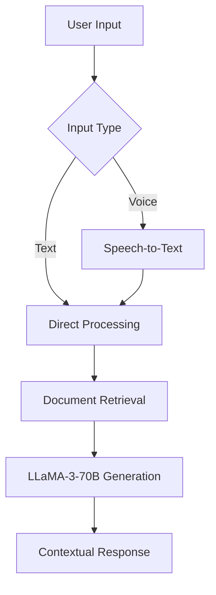

# TARS 🌌

TARS is an advanced conversational AI assistant built with Streamlit and Groq, inspired by the iconic TARS robot from *Interstellar*. Combines cutting-edge language models with document intelligence for engaging, context-aware interactions.

**Live Demo**: [https://tars-the-quantum-bot.streamlit.app/](https://tars-the-quantum-bot.streamlit.app/)


## Key Features 🚀

- **Voice-to-Text Input** 🎤: Speak directly to TARS with multilingual support
- **Document Intelligence** 📚: Process PDF, DOCX, TXT files with RAG integration
- **Multilingual Support** 🌍: 12 language options for voice input
- **Instant Responses** ⚡: Powered by Groq's LLaMA-3-70B model
- **Personality Modes** 🤖: Quirky interstellar-themed interactions
- **Conversation Memory** 💾: Context-aware dialogue tracking
- **Zero Setup Vector Store** 🧠: In-memory ChromaDB for document analysis

## Enhanced RAG Architecture 🔍



1. **Document Processing**:
   - Automatic file type detection (PDF/DOCX/TXT)
   - Chunking with overlap for context preservation
   - Hugging Face MiniLM-L6-v2 embeddings
   - ChromaDB vector storage

2. **Conversational Chain**:
   - Hybrid voice/text input handling
   - Contextual document retrieval (5 nearest neighbors)
   - Memory-enhanced generation pipeline

## Getting Started 🛠️

### Requirements
- Python 3.10+
- Groq API Key ([Get Here](https://console.groq.com/))
- Modern web browser

### Installation

```bash
pip install -r requirements.txt
```

**requirements.txt**:
```
langchain
langchain_community
langchain_core
langchain_groq
sentence-transformers
streamlit
chromadb
pypdf
protobuf==3.20.0
pysqlite3-binary==0.5.3
python-dotenv
streamlit-mic-recorder
```

### Configuration

1. Create `.env` file:
```
GROQ_API_KEY=your_api_key_here
```

2. Launch TARS:
```bash
streamlit run app.py
```

## Usage Guide 📖

1. **Start Chatting**:
   - Type questions or click 🎤 to voice chat
   - Choose from 12 languages for voice input

2. **Document Analysis**:
   - Upload files via sidebar
   - Ask questions about content
   - Supported formats: PDF, DOCX, DOC, TXT

3. **Special Commands**:
   - "What's your name?" - Personality reveal
   - "Who are you?" - Mission statement
   - "New Chat" button to reset context

## Customization ⚙️

1. **Model Settings**:
```python
# app.py Line 28
ChatGroq(
    model="llama-3.3-70b-versatile",  # Change model here
    temperature=0.5,  # Adjust creativity (0-1)
)
```

2. **UI Customization**:
   - Modify `greetings` array for new welcome messages
   - Adjust `language_map` for additional languages
   - Edit response lists for personality tuning

## Troubleshooting 🔧

| Issue | Solution |
|-------|----------|
| Microphone Access | Allow browser permissions |
| API Errors | Verify .env file setup |
| Doc Processing | Check file formats/sizes |
| Voice Input | Ensure language match |

## Contribution 🤝

Found a bug or have suggestions?  
📧 Contact: [mokakrishna212@gmail.com](mailto:mokakrishna212@gmail.com)

