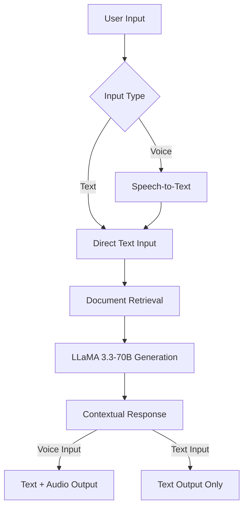

# 🌌 TARS ChatBot

TARS is a futuristic AI assistant built with **Streamlit** and **Groq**, inspired by the witty and helpful robot from *Interstellar*. It blends conversational memory, document intelligence, voice input, and powerful LLMs for immersive, multilingual interactions.

🔗 **Live Demo**: [https://tars-the-quantum-bot.streamlit.app/](https://tars-the-quantum-bot.streamlit.app/)

---

## 🚀 Features

- 🎤 **Voice-to-Text Input** (12 Languages)
- 📚 **Document QA with RAG**: PDF, DOCX, DOC, TXT support
- 🌍 **Multilingual Support** for speech
- ⚡ **Groq’s LLaMA-3.3-70B** for instant responses
- 🤖 **Humorous Personality Modes** inspired by TARS
- 💾 **Conversation Memory** using LangChain
- 🧠 **Zero Setup Vector Store**: FAISS-based document retrieval

---
## Enhanced RAG Architecture 🔍



---

## 🛠️ Getting Started

### 1. Requirements

- Python 3.10+
- Groq API Key → [Get it here](https://console.groq.com/)

### 2. Installation

```bash
pip install -r requirements.txt
```

**requirements.txt:**
```
langchain
langchain_community
langchain_core
langchain_groq
sentence-transformers
streamlit
chromadb
pypdf
protobuf==3.20.0
pysqlite3-binary==0.5.3
python-dotenv
streamlit-mic-recorder
gTTS
```

---

### 3. Configuration

Create a `.env` file:

```env
GROQ_API_KEY=your_api_key_here
```

---

### 4. Launch App

```bash
streamlit run app.py
```

---

## 📖 Usage Guide

- **💬 Chat**: Type or speak to TARS using your mic
- **📁 Upload Documents**: Supports `.pdf`, `.docx`, `.doc`, `.txt`
- **🧠 Ask Anything**: TARS answers based on file contents
- **🗣️ Voice Input**: Select language and speak your query

---

## ⚙️ Customization

- **Model Config** (`app.py`):
```python
ChatGroq(
    model_name="llama-3.3-70b-versatile",
    temperature=0.5,
)
```

- **UI Tweaks**:
  - Edit greetings in the `greetings` list
  - Modify supported languages in `language_selector()`
  - Customize bot personality in `name_responses`, `who_are_you_responses`

---

## 🔧 Troubleshooting

| Problem | Fix |
|--------|------|
| 🎙️ Mic Not Working | Allow browser mic access |
| ❌ API Error | Check `.env` and API key |
| 📄 File Not Processing | Ensure supported file formats |
| 🗣️ Voice Doesn’t Work | Match correct language |

---

## 🤝 Contribution & Contact

Have ideas or found a bug?  
📧 Email: [mokakrishna212@gmail.com](mailto:mokakrishna212@gmail.com)

---
